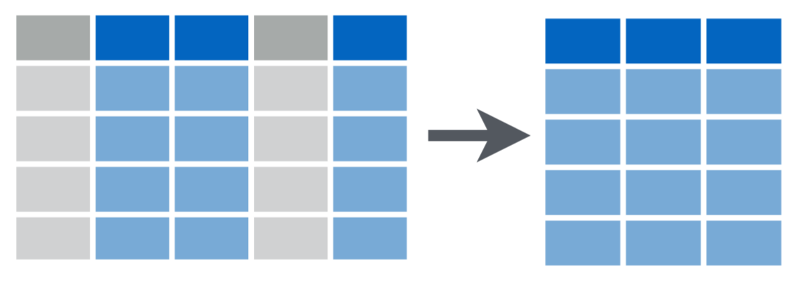
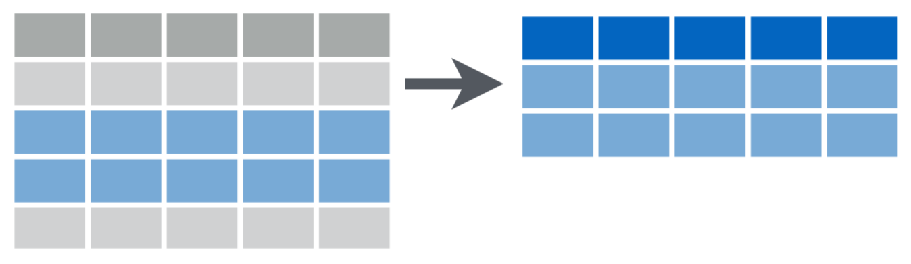
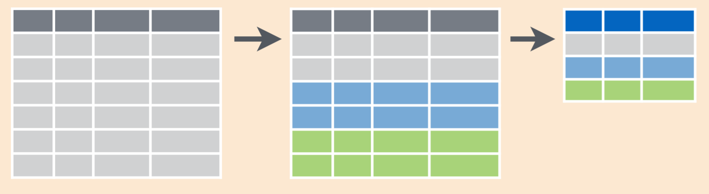
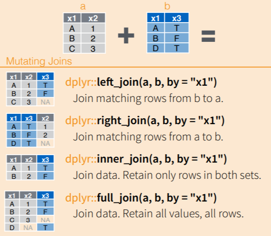

```{r setup, include=FALSE}
knitr::opts_chunk$set(render = function(x, ...){
    unlockBinding(".Last.value", .BaseNamespaceEnv)
    assign(".Last.value", x, .BaseNamespaceEnv)
    lockBinding(".Last.value", .BaseNamespaceEnv)
    knitr::knit_print(x, ...)
}) # allows us to use .Last.value in knitted .Rmd file as we would in R console
```

\setcounter{tocdepth}{4}
\tableofcontents

# I. Intro to tidyverse

```{r, echo=FALSE}

```

## 1. Why use tidyverse?

- curated [*collection*](https://www.tidyverse.org/packages) of packages for data science
- packages share data classes and grammar
- low entry threshold
- database-like approach
- **aes**thetically pleasing visualizations
- big community and great resources online

Let's import tidyverse packages:

```{r}
library(tidyverse)
```

The output information provides as with a useful insight into name conflicts. The more packages you have attached, the more likely some of conflicts appear.

You can also suppress this message by running:
```{r}
suppressPackageStartupMessages(library(tidyverse))
```

## 2. Pipe operator %>% 

It allows as to chain operations together for convenience and better readability. 

```{r}
as.character(round(mean(seq(100))))

seq(100) %>% 
  mean() %>%
  round() %>%
  as.character()
```


## 3. *tibbles*

Basic data object in tidyverse. It's basically an improved/modernized data.frame.

```{r}
tibble(numbers=c(1,2,3),names=c('a','b','c'))
```

```{r}
tb <- .Last.value #let's save our tibble on variable
```

How do we make conversions between data.frames and tibbles?

```{r}
# convert tibble to data frame
df <- as.data.frame(tb)
# add rownames
row.names(df) <- c("row1", "row2", "row3")
df
```

```{r}
# convert data.frame to tibble
as_tibble(df)
as_tibble(df, rownames = "row_names")
```

How to add new rows to the tibble?
```{r}
#adding new rows
add_row(tb, numbers=4, names="d")
tb 
tb <- add_row(tb, numbers=4, names="d")
tb
```

How to add new column to the tibble?
```{r}
# we can treat the tibble as a data.frame
tb$squres <- tb$numbers^2
tb
```
```{r}
# or we can use tidyverse 'mutate' operation
tb %>% mutate(cubes = squres*numbers)
```
We will talk more about 'mutate' and other tidyverse operation soon.

How to save and read local data file?
```{r}
# saving tibble to file
write_tsv(tb, path = "new_tibble.tsv")

# loading local data
countries <- read_tsv('countries.tsv')
# explicitly specyfying column types in loaded data
countries <- read_tsv('countries.tsv', col_types=c(col_double(), col_character()))
# accepting default inferred coulumn types
countries <- read_tsv('countries.tsv', col_types=cols()) 
countries
```
This example file was created based on estimated population data available at "United Nations data" [*website*](http://data.un.org).

Other data we are going to explore today is penguins data set, which contains information about 3 species of penguins. 
Data was collected and by [*Dr. Kristen Gorman*](https://www.uaf.edu/cfos/people/faculty/detail/kristen-gorman.php) and the [*Palmer Station, Antarctica LTER*](https://pal.lternet.edu), a member of the [*Long Term Ecological Research Network*](https://lternet.edu). Artwork by [*@allison_horst*](https://twitter.com/allison_horst).

```{r, echo=FALSE, out.width= "100%", fig.align='center'}
knitr::include_graphics('images/palmer_penguins.png')
```

```{r}
library(palmerpenguins)
penguins
```

Tip: remember that you can still use usual 'data.frame-like' operations on this data set. Try checking dimensions with *dim(penguins)* or looking at whole dataset with *View(penguins)*.

```{r, echo=FALSE, out.width= "100%",fig.align='center'}
knitr::include_graphics('images/palmer_penguins_bill.png')
```

Alright, now that we have some data, let's talk about basic operations on data you can do with tidyverse!

## 4. Basic tidyverse operations

Here are some useful commands you can use to explore your data. Included figures are taken from the [*Data Wrangling with dplyr nd tidyr Cheat Sheet*](https://rstudio.com/wp-content/uploads/2015/02/data-wrangling-cheatsheet.pdf).

### (1) Subsetting data

- use **select** to select columns by names (or helper function)

```{r, echo=FALSE, out.width="60%"}

```

- use **filter** to select rows that meet logical criteria / select rows based on value in specific column

```{r, echo=FALSE, out.width="60%"}

```

### (2) Ordering data

- use **arrange** to order your rows by a column value (from row to high)

- combine **arrange** with **desc** to reverse the order

### (3) Updating your data

- use **mutate** to add new columns or change values in existing columns

- use **separate** to separate values in column into multiple columns and **unite** to reverse the process

```{r, echo=FALSE, out.width="60%"}

```

### (4) Grouping and summarizing data

- use **group_by** to group the rows based on value in column -> it will add additional layer of organization for other functions

- use **summarise** to summarise your data into single row of values, combine it with **group_by** to calculate statistics for your groups

```{r, echo=FALSE, out.width="75%"}

```

### (5) Combining data sets

- use **left_join** or **right_join** to add columns from one data set to compatible rows of second data set

- use **inner_join** to combine data sets and preserve only common rows 

- use **full_join** to combine data sets and preserve all rows

```{r, echo=FALSE, out.width="50%"}

```

# II. Data exploration & Plotting

## 1. *Palmer penguins* dataset

Let's try using this operations to explore our data sets. How about we take a "glimpse" into our penguin dataset?

```{r}
glimpse(penguins)
```

Here is the data column specification: 

- *species* a factor denoting penguin species

- *island* a factor denoting island in Palmer Archipelago, Antarctica

- *bill_length_mm* a number denoting bill length (in millimeters)

- *bill_depth_mm* a number denoting bill depth (in millimeters)

- *flipper_length_mm* an integer denoting flipper length (in millimeters)

- *body_mass_g* an integer denoting body mass (in grams)

- *sex* a factor denoting penguin sex

- *year* variable denoting the study year

Tip: Pay special attention to data types inferred by tidyverse. This data was already cleaned up and prepared for analysis.
Factor type variables will be very important for grouping and plotting our data.

## 2. How many penguins of each species is in the dataset?

We are only interested in 'species' column, so we can subset the dataset. (This is an optional step, just for exercise and visual purposes.)

```{r}
select(penguins, species)
```

How to do it when using %>% operator?
```{r}
penguins %>% 
  select(species)
```

**Bonus (1)**: Other example uses of **select**:

```{r}
# select two columns
penguins %>% select(species, sex)
# select everything but 'species' column
penguins %>% select(- species)
# select coumns with regular expression
penguins %>% select(matches("bill*"))
```

**Bonus (2)**: How to extract values from the tibble? (Here we use *head* function to show only first values in the vector)
```{r}
# Option 1 -> deframing the vector 
penguins %>%
  select(species) %>%
  deframe() %>%
  head()

# Option 2 -> selecting 'in place'
penguins %>%
  .$species %>%
  head()
```

Moving on to our exercise...

Let's try counting our penguins with **summarise** function:

```{r , warning=FALSE, message=FALSE}
penguins %>%
  summarise(count=n())
```

Well that's all of our penguins. If we are interested in looking at different species we should group data with **group_by** before.

```{r, warning=FALSE, message=FALSE}
# just grouping our penguins does not visually affect the data
penguins %>% 
  group_by(species)

penguins %>%  
  group_by(species) %>%
  summarise(count=n())
```

This looks nice, but it would look even better if we plot it

## 3. **How to plot in ggplot2?**

The **ggplot2** has very specific *grammar*, which provides the rules on how to effectively create plots. We construct the plots step, by step by adding additional levels of organization. This *layering* of plot elements provides us with a great control over our plot and high level of possible customization. Take a look at this figure below (created and made available by [*Coding Club*](https://ourcodingclub.github.io) on CC BY 4.0 license) to get preview of what we are going to do.

```{r, echo=FALSE, out.height="80%", fig.align='center'}
knitr::include_graphics("images/ggplot_layers.png")
```
Hmm... I wonder if our penguins with bigger flippers are also heavier? We will check this out in a moment! Now let's try to create a plot showing a distribution of species in our dataset.

### (1) Create base ggplot object

```{r, out.width="80%", fig.align='center', warning=FALSE, message=FALSE}
penguins %>% 
  group_by(species) %>%
  summarise(count=n()) %>%
  ggplot() # or ggplot(penguins)
```

Well... that didn't work. However, we didn't even specify what we want to plot yet so it's understandable. 

### (2) Add aesthetics to the plot

*Aesthetics* specify what we want to plot (map variables to *x* and *y axis* and other parts of plot such as its color).
Here we want to show the difference in species distribution (let's add nice colors on top of it).

```{r, out.width="80%", fig.align='center', warning=FALSE, message=FALSE}
penguins %>% 
  group_by(species) %>%
  summarise(count=n()) %>%
  ggplot(aes(x=species, y=count, color=species)) 
```
That's a good start. Now the question is how exactly we want to show the data?

### (3) Add geometric layers

There is many different types of plots. Here because we want to show a difference in one categorical variable across groups, let's aim for simple barplot.

```{r, out.width="80%", fig.align='center', warning=FALSE, message=FALSE}
# we use 'identity' when we build barplot with x and y values, 
#by defult it requires only x values
penguins %>% 
  group_by(species) %>%
  summarise(count=n()) %>%
  ggplot(aes(x=species, y=count, color=species)) +
  geom_bar(stat="identity")
```
My friends and foes we have a plot! Only... the colors are not quite alright. What happened? ggplot uses two different parameters for setting colors, in general *color*/*colour* defines the color of the geom outline and *fill* specifies what color the geom is filled with. Let's correct it!

```{r, out.width="80%", fig.align='center', warning=FALSE, message=FALSE}
penguins %>% 
  group_by(species) %>%
  summarise(count=n()) %>%
  ggplot(aes(x=species, y=count, fill=species)) +
  geom_bar(stat="identity")
```

**Bonus (3)**: Note about *aes()* placement. By placing aesthetics in *ggplot()* function, they will be applied to every *geom* function. I recommend binding our aesthetics to specific *geoms* instead. This way we can mix and match *geoms* with different mappings.

```{r, echo=TRUE, eval=FALSE, warning=FALSE, message=FALSE}
# this is an equivalent of last commend
penguins %>% 
  group_by(species) %>%
  summarise(count=n()) %>%
  ggplot() +
  geom_bar(aes(x=species, y=count, color=species), stat="identity")
```

### (3) Mixing different geoms

Let's try adding labels with specific count to our plot with *geom_label* (We can also use *geom_text*).
```{r, out.width="80%", fig.align='center', warning=FALSE, message=FALSE}
penguins %>% 
  group_by(species) %>%
  summarise(count=n()) %>%
  ggplot() +
  geom_bar(aes(x=species, y=count, fill=species), stat="identity") +
  geom_label(aes(x=species, y=count, label=count))
```
This looks very good already but there is much more things we could do.

### (3) Customizing your plots.
 
We definitely cannot cover all the different way you can improve your plot, but here are some examples of possible customizations:

- updating axis labels and title (all can be changed with *labs* function, or by adding *xlab*, *ylab* and *ggtitle*)

- add a bit of transparency to our bars (with *alpha* parameter) so we can see our grid a bit better

- changing color palette to color-blind friendly palette

- adding new *theme** to our plot (quick change of plot appearance, see more [*here*](https://ggplot2.tidyverse.org/reference/ggtheme.html) and [*here*](https://github.com/jrnold/ggthemes))

- editing our theme, ex. to change legend placements, removing legend altogether if it's not needed or changing fonts

Also not applicable here (some we will see later on):

- changing axis limits (with *xlim* and *ylim*)

- changing shape of data points

- adding error bars / error bar ribbons

- fitting linear model to scatter plots

Let's add some of that to our plot!

```{r, out.width="80%", fig.align='center', warning=FALSE, message=FALSE}
library(PNWColors) # great library, with color-blind friendly palettes

penguins %>% 
  group_by(species) %>%
  summarise(count=n()) %>%
  ggplot() +
  geom_bar(aes(x=species, y=count, fill=species), stat="identity") +
  geom_label(aes(x=species, y=count, label=count)) +
  labs(title="Penguin species", y="number of penguins", fill="") +
  theme_bw() +
  theme(legend.position = "bottom") +
  scale_fill_manual(values = pnw_palette("Bay",3))
```

Let's save our plot for later:
```{r}
species_plot <- last_plot()
```

### (4) Facets

Let's look at penguins of both sexes separately. *facet_wrap* and *facet_grid* functions can split data into a additional panels based on one or combination of multiple factor values. 

All "small" plots represents the same graphical idiom, but with data from a different level of the faceting variable. This is different then plotting different geoms side by side, which we will see later on.

```{r, out.width="80%", fig.align='center', warning=FALSE, message=FALSE}
penguins %>% 
  group_by(species, sex) %>% #we are adding new grouping variable
  summarise(count=n()) %>%
  ggplot() +
  geom_bar(aes(x=species, y=count, fill=species), stat="identity") +
  geom_label(aes(x=species, y=count, label=count)) +
  labs(title="Penguin species", y="number of penguins", fill="") +
  theme_bw() +
  theme(legend.position = "bottom") +
  scale_fill_manual(values = pnw_palette("Bay",3)) +
  facet_wrap(~sex) # split based on sex
```

The plot looks nice, but unexpectedly we have discovered that some penguins' sex was not identified. This is a good opportunity to practice some data filtering.

```{r}
# how many NA's is in the colum
penguins %>% filter(is.na(sex))
```

There is 11 rows that need to be filtered out.

```{r, warning=FALSE, message=FALSE}
# filter out this rows
penguins %>%
  filter(!is.na(sex)) %>% # filter out this rows
  group_by(species, sex) %>%
  summarise(count=n())
```

Great! Now let's plot it again:

```{r, out.width="80%", fig.align='center', warning=FALSE, message=FALSE}
penguins %>% 
  filter(!is.na(sex))%>%
  group_by(species, sex) %>% #we are adding new grouping variable
  summarise(count=n()) %>%
  ggplot() +
  geom_bar(aes(x=species, y=count, fill=species), stat="identity") +
  geom_label(aes(x=species, y=count, label=count)) +
  labs(title="Penguin species", y="number of penguins in dataset", fill="") +
  theme_bw() +
  theme(legend.position = "bottom") +
  scale_fill_manual(values = pnw_palette("Bay",3)) +
  facet_wrap(~sex) # split based on sex
```

**Bonus (4)**: More **filter** examples
```{r}
# filter based on catgorical variable
penguins %>% filter(species == 'Adelie')
# filter based on threshold for continuous variable
penguins %>% filter(bill_depth_mm>(bill_length_mm/2))
# filter based on multiple values of one variable
penguins %>% filter(species %in% c('Adelie', 'Gentoo'))
# filter with multiple conditions (use '&' operator as AND, '|' operator as OR)
penguins %>% filter(species == 'Adelie' & island == 'Torgersen')
```

## 4. Does heavier penguins have longer flippers? 

### (1). Let's explore the data

We are interested in penguin body mass and flipper length for different species.

```{r}
penguins %>%
  select(species, body_mass_g, flipper_length_mm)
```

Let's check what species have highest and lowest body mass:
```{r}
penguins %>%
  select(species, body_mass_g, flipper_length_mm) %>%
  arrange(desc(body_mass_g)) #descending order
```

We can also calculate average body mass and flipper length across species.

```{r, warning=FALSE, message=FALSE}
# check mean body mass and flipper length across species
penguins %>%
  group_by(species) %>%
  summarise(mean_mass = mean(body_mass_g, na.rm=TRUE),
            mean_flipper_length = mean(flipper_length_mm, na.rm=TRUE))
```

**Bonus (5)**: **summarize** function can do much more then just counting penguins and means!
```{r, warning=FALSE, message=FALSE}
# check mean, maximum and minimum body mass of penguins across species
penguins %>%
  group_by(species) %>%
  summarise(count=n(), 
            mean_mass = mean(body_mass_g, na.rm=TRUE), 
            min_mass = min(body_mass_g, na.rm = TRUE), 
            max_mass = max(body_mass_g, na.rm = TRUE))
# calculate mean accross all numeric columns
penguins %>% 
  group_by(species) %>% 
  summarize(across(where(is.numeric), mean, na.rm = TRUE)) %>%
  select(-year) # remove year column from output
```

Are there differences in average body mass to flipper length ratio across species? Let's use **mutate** to create new column in our dataset.
```{r}
penguins %>%
  group_by(species) %>%
  mutate(ratio=body_mass_g/flipper_length_mm)
```

```{r, warning=FALSE, message=FALSE}
penguins %>%
  group_by(species) %>%
  mutate(ratio=body_mass_g/flipper_length_mm) %>%
  summarise(avg_ratio = mean(ratio, na.rm = TRUE))
```

Our results sure look promising, but we cannot really tell only based only on means. Let's plot the data! What type of plot do we want to use? How about we show every penguin as a data point? 

### (2) Plotting the relationship between two continuous variables

Do we have any missing values?

```{r}
penguins %>%
  filter(is.na(body_mass_g) | is.na(flipper_length_mm))
```

We will have to filter this two penguins out, before plotting:

```{r, out.width="80%", fig.align='center'}
penguins %>%
  filter(!is.na(body_mass_g) & !is.na(flipper_length_mm)) %>%
  ggplot() +
  geom_point(aes(x=body_mass_g, y=flipper_length_mm, color=species))
```

This is great! It looks like there is some correlation here. Also *Gentoo* penguins are clearly the biggest birds.
Let's fit linear model to our data to better show trend - gray band is 95% confidence level interval for predictions from model.

```{r, out.width="80%", fig.align='center'}
penguins %>%
  filter(!is.na(body_mass_g) & !is.na(flipper_length_mm)) %>%
  ggplot() +
  geom_point(aes(x=body_mass_g, y=flipper_length_mm, color=species)) +
  geom_smooth(aes(x=body_mass_g, y=flipper_length_mm), method = "lm")
```

### (3) Customizing the plot

This already looks very good! Let's customize this plot a bit and fit model separately to show trend in different species.

```{r, out.width="80%", fig.align='center'}
penguins %>%
  filter(!is.na(body_mass_g) & !is.na(flipper_length_mm)) %>%
  ggplot() +
  geom_point(aes(x=body_mass_g, y=flipper_length_mm, color=species), 
             size=3) + # increase size of points
  geom_smooth(aes(x=body_mass_g, y=flipper_length_mm, group=species, color=species), 
              method = "lm", se=FALSE) +
  labs(x= "Body mass [g]", y= "Flipper length [mm]", 
       title = "Heavier penguins have bigger wingspan", color="") +
  theme_bw() +
  theme(legend.position = "bottom") +
  scale_color_manual(values = pnw_palette("Bay",3)) # use 'color' (not 'fill') palette
```

Let's save our plot for later:
```{r}
mass_wingspan_plot <- last_plot()
```

## 5. What is the distribution of bill length across species?

### (1). Let's explore the data

Check mean values of bill length across species.

```{r, warning=FALSE, message=FALSE}
penguins %>%
  filter(! is.na(bill_length_mm)) %>% # filter out missing values
  group_by(species) %>%
  summarise(mean_bill_length=mean(bill_length_mm, na.rm = TRUE))
```
Even though we observed that *Gentoo* are the biggest birds, the difference between average bill length is not very big.

### (2) Plotting continuous variable across different groups

```{r, out.width="80%", fig.align='center'}
penguins %>%
  filter(!is.na(bill_length_mm)) %>%
  ggplot() +
  geom_point(aes(x=species, y=flipper_length_mm, color=species))
```
Hmm... that doesn't look right, we cannot use the same *geom* type. What should we use?

#### **Which plot type is appropriate for our data?**
\  

The answer to this questions is not always immediately obvious. The most important thing to consider is what are the types of variables we want to display. Take a look at this figure (also created by [*Coding Club*](https://ourcodingclub.github.io)).

```{r, echo=FALSE, out.width="100%", fig.align='center'}
knitr::include_graphics("images/plot_types.png")
```

We want to show a distribution of continuous variable across different groups. Let's use boxplot!

```{r, out.width="80%", fig.align='center'}
penguins %>%
  filter(!is.na(bill_length_mm)) %>%
  ggplot() +
  geom_boxplot(aes(x=species,y=bill_length_mm, fill=species))
```

This is an improvement, but if we want to also see our specific data point we can do it with a variation of *geom_point* called *geom_jitter* (it adds a bit of noise to points position, so we will be able to see our observations).

```{r, out.width="80%", fig.align='center'}
penguins %>%
  filter(!is.na(bill_length_mm)) %>%
  ggplot() +
  # hide outliers
  geom_boxplot(aes(x=species,y=bill_length_mm, fill=species), outlier.alpha = 0) +
  # we restrict variation of point heights
  geom_jitter(aes(x=species, y=bill_length_mm), width = 0.2, height = 0)
```

Even though we saw that *Adelie* and *Chinstrap* penguins have similar sizes (or at least wingspan and body mass) it looks like former have much shorter bills. Let's customize our plot and finish!

```{r, out.width="80%", fig.align='center'}
penguins %>%
  filter(!is.na(bill_length_mm)) %>%
  ggplot() +
  geom_boxplot(aes(x=species,y=bill_length_mm, fill=species), outlier.alpha = 0) + 
  geom_jitter(aes(x=species, y=bill_length_mm), 
              width = 0.2, height = 0, size=2, alpha=0.4) + # add transparency to points
  labs(y= "Bill length [mm]", title = "Bill length across different species", fill="") +
  theme_bw() +
  theme(legend.position = "bottom") +
  scale_fill_manual(values = pnw_palette("Bay",3))
```

Let's save our plot:
```{r}
bill_plot <- last_plot()
```

### (3) Combining different plots

We created three different plots for *palmerpenguins* dataset. How can we see them together? This is a different then creating *facets*, because every plot represents different data. One of the easiest way to display different plots together is to use *ggarrange* function from *ggpubr* package.

```{r, out.width="100%", fig.align='center'}
library(ggpubr)
# the input are variables with our saved plots
ggarrange(species_plot, bill_plot,mass_wingspan_plot,
          nrow=2, ncol=2,# you can specify number of rows and columns
          common.legend = TRUE,
          align = "hv",
          labels = c('A', 'B', 'C'))
```

Almost done, let's add something extra!

```{r, out.width="100%", fig.align='center'}
library(png)
logo_png <- readPNG("images/palmer_logo.png")
logo_img <- ggplot() + background_image(logo_png) + coord_fixed() #fix image ratio 

ggarrange(species_plot, bill_plot, mass_wingspan_plot, logo_img,
          nrow=2, ncol=2,
          common.legend = TRUE,
          align = "hv",
          labels = c('A', 'B', 'C', ""),
          widths = c(1,1,1,0.5))
```


## 6. Importance of reshaping your data

The *palmerpenguins* dataset is already preprocessed and prepared for analysis. This is not always the case. When using your own data frequently check if your observations are in correct orientation (rows or columns). This is extremely important when plotting data, because most of the operations is based on assumption of variables being in columns of the tibble.

*Q*: What to do when this is not the case? 

*A*: We have to reshape the data with the help of **gather** and **spread** operations.

*Q*: How do we decide if our data need reshaping?

*A*: Think about effect you need to achieve and work your way down!

Let's see an example! Remember *countries* dataset we loaded from the file?

```{r}
countries
```

Let's say we are interested in seeing a (line) plot of population change over time in separate countries. To make things extra complicated we want to look at both sexes together.

What variables we would need? 

- country for grouping purposes

- year for *x axis*

- (summed) population for *y axis*

This is what we would call a "*wide*" dataset, each different variable is in the different column. We want to reshape the data into a *long* (or *narrow*) dataset. This is where **gather** operation comes to our aid:

```{r}
countries %>%
  gather(key="country", value="population", -year, -sex)
```

Let's save this data on variable for our plot.
```{r}
long_countries <- .Last.value
```

We can revert this situation by using a **spread** command. It's very helpful in case if we want to focus only on specific observations.

```{r}
long_countries %>%
  spread(key = country, value=population)
```

Here is the plot we wanted to make:

```{r, out.width="80%", fig.align='center', warning=FALSE, message=FALSE}
long_countries %>%
  group_by(year, country) %>%
  summarise(total_population=sum(population)) %>% # we are interested in total population
  ggplot(aes(x=year, y=total_population, group=country, color=country)) +
  geom_line(size=1) +
  geom_point(size=3)  +
  labs(y="estimated population", title = "Population over time", color="") +
  theme_bw() +
  theme(legend.position = "top") +
  scale_color_manual(values = pnw_palette("Sailboat",4))
```
